# 🚀 Processador Assíncrono de Documentos com OCR na Nuvem

## 🎯 Objetivo do Projeto

Este projeto demonstra a construção de um sistema backend robusto, escalável e 100% cloud-native, projetado para resolver um desafio de negócio real: a extração de texto de documentos PDF de forma assíncrona. A solução utiliza uma arquitetura moderna, orientada a eventos, para garantir alta performance e resiliência, mesmo sob alta carga de trabalho.

## 💡 O Problema de Negócio

Empresas de diversos setores (financeiro, saúde, jurídico) lidam com um volume massivo de documentos não estruturados, como faturas, contratos e formulários. Extrair informações valiosas desses arquivos manualmente é um processo lento, caro e sujeito a erros.

Este projeto automatiza essa tarefa, criando um pipeline de dados que:

* Recebe um documento PDF via API REST.
* Processa o arquivo em segundo plano, sem impactar a experiência do usuário.
* Utiliza Inteligência Artificial para realizar o Reconhecimento Óptico de Caracteres (OCR).
* Armazena o texto extraído de forma estruturada em um banco de dados, pronto para ser consultado, indexado ou analisado.

## 🏗️ Arquitetura da Solução

A espinha dorsal do projeto é uma arquitetura orientada a eventos e totalmente desacoplada, orquestrando diferentes serviços da AWS para criar um fluxo de trabalho resiliente.

### Fluxo do Processamento:


## 🛠️ Decisões Técnicas

* **Java com Spring Boot**: pela robustez, ecossistema maduro e facilidade de criar APIs REST.
* **Amazon SQS**: desacopla o recebimento do arquivo do seu processamento.
* **Amazon S3**: armazenamento de objetos confiável e barato.
* **Amazon Textract**: serviço de OCR gerenciado e altamente preciso.
* **Pivot de Tesseract para Textract**: migração estratégica para IA gerenciada e mais confiável.

## 💻 Tecnologias Utilizadas

| Tecnologia          | Descrição                                                              | Versão (se aplicável) |
| ------------------- | ---------------------------------------------------------------------- | --------------------- |
| **Java**            | Linguagem de programação principal.                                    | 17                    |
| **Spring Boot**     | Framework para criação de APIs REST de forma rápida e eficiente.       | 3.x                   |
| **Spring Data JPA** | Facilita a persistência de dados e a comunicação com o banco.          | 3.x                   |
| **PostgreSQL**      | Sistema de gerenciamento de banco de dados relacional.                 | 16 ou superior        |
| **Amazon S3**       | Serviço de armazenamento de objetos para os arquivos PDF.              | N/A                   |
| **Amazon SQS**      | Serviço de fila de mensagens para o processamento assíncrono.          | N/A                   |
| **Amazon Textract** | Serviço de IA para extração de texto (OCR) de alta precisão.           | N/A                   |
| **Lombok**          | Biblioteca para reduzir o código boilerplate (getters, setters, etc.). | 1.18.30               |
| **Maven**           | Ferramenta de automação de build e gerenciamento de dependências.      | 3.8+                  |
| **IntelliJ IDEA**   | Ambiente de Desenvolvimento Integrado (IDE).                           | Community Edition     |
| **Postman**         | Ferramenta para testar os endpoints da API.                            | N/A                   |
| **Git & GitHub**    | Sistema de controle de versão.                                         | N/A                   |

## ⚙️ Como Executar o Projeto

### ✅ Pré-requisitos

* Java (JDK 17)
* Maven 3.8+
* Conta na AWS com as credenciais configuradas via AWS CLI (`aws configure`)
* PostgreSQL instalado e rodando

### 🚀 Passos para Configuração

1. **Clone o repositório**:

```bash
git clone https://github.com/seu-usuario/ocr-pdf-processor.git
```

2. **Configure o `application.properties`**:

* Localize: `src/main/resources/application.properties`
* Atualize as propriedades:

    * `spring.datasource.url`
    * `spring.datasource.username`
    * `spring.datasource.password`
    * `spring.cloud.aws.credentials.access-key`
    * `spring.cloud.aws.credentials.secret-key`
    * `app.aws.s3.bucket-name`

3. **Crie os Recursos na AWS**:

* Bucket no **Amazon S3**
* Fila padrão no **Amazon SQS**
* Conceda permissões IAM: `AmazonS3FullAccess`, `AmazonSQSFullAccess`, `AmazonTextractFullAccess`

4. **Crie o Banco de Dados**:

* Crie o schema com o nome definido em `spring.datasource.url`

5. **Execute a Aplicação**:

* Rode a classe `OcrPdfProcessorApplication.java`
* O Hibernate criará automaticamente a tabela `processamentos_pdf`

## 🔌 Endpoints da API

### 1. Upload de PDF

Inicia o processo de extração de texto de um arquivo PDF.

* **URL**: `/api/pdf/upload`
* **Método**: `POST`
* **Body**: `form-data`

    * `file` → (Selecionar arquivo PDF)

#### ✅ Exemplo de Resposta:

```json
{
  "idProcessamento": "a1b2c3d4-e5f6-7890-1234-567890abcdef",
  "status": "AGUARDANDO",
  "mensagem": "Arquivo recebido. O processamento foi iniciado."
}
```

### 2. Consultar Status do Processamento

Verifica o status atual de um trabalho de processamento.

* **URL**: `/api/pdf/status/{id}`
* **Método**: `GET`

#### 🔁 Exemplo de Resposta (Processando):

```json
{
  "idProcessamento": "a1b2c3d4-e5f6-7890-1234-567890abcdef",
  "status": "PROCESSANDO"
}
```

#### ✅ Exemplo de Resposta (Concluído):

```json
{
  "idProcessamento": "a1b2c3d4-e5f6-7890-1234-567890abcdef",
  "status": "CONCLUIDO",
  "textoExtraido": "Este é o texto completo que foi extraído do seu documento PDF..."
}
```

#### ❌ Exemplo de Erro (404):

```json
{
  "mensagem": "ID de processamento não encontrado."
}
```

---
> Documentação da API com Swagger (OpenAPI 3): http://localhost:8081/swagger-ui.html
